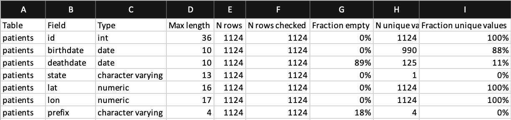

# Introduction
## Scope and purpose
WhiteRabbit is a software tool to help prepare for ETLs (Extraction, Transformation, Loading) of longitudinal healthcare databases into the [Observational Medical Outcomes Partnership (OMOP) Common Data Model (CDM)](www.github.com/OHDSI/CommonDataModel/wiki).
The source data can be in comma-separated text files, SAS files, or in a database (MySQL, SQL Server, Oracle, PostgreSQL, Microsoft APS, Microsoft Access, Amazon RedShift, PDW, Teradata, Google BigQuery).
Note that for support of the OHDSI analytical tooling, the OMOP CDM will need to be in one of a limited set of database platforms (SQL Server, Oracle, PostgreSQL, Microsoft APS, Amazon RedShift, Google BigQuery, Impala).

WhiteRabbit’s main function is to perform a scan of the source data, providing detailed information on the tables, fields, and values that appear in a field.
This scan will generate a report that can be used as a reference when designing the ETL, for instance by using the Rabbit-In-a-Hat tool.
White Rabbit differs from standard data profiling tools in that it attempts to prevent the display of personally identifiable information (PII) data values in the generated output data file.

## Process Overview
The typical sequence for using this software to scan source data in preparation of developing an ETL into an OMOP CDM:
1. Set working folder, the location on the local desktop computer where results will be exported.
2. Connect to the source database or CSV text file and test connection.
3. Select the tables of interest for the scan and scan the tables.
4. WhiteRabbit creates an export of information about the source data.

Once the scan report is created, this report can then be used in the Rabbit-In-a-Hat tool or as a stand-alone data profiling document.

# Installation and support

All source code and installation instructions available on GitHub: <https://github.com/OHDSI/WhiteRabbit>

Any bugs/issues/enhancements should be posted to the GitHub repository: <https://github.com/OHDSI/WhiteRabbit/issues>

Any questions/comments/feedback/discussion can be posted on the OHDSI Developer Forum: <http://forums.ohdsi.org/c/developers>

# Using the Application Functions

## Specifying the Location of Source Data


### Working Folder

Any files that WhiteRabbit creates will be exported to this local folder.
Use the “Pick Folder” button to navigate in your local environment where you would like the scan document to go.

### Source Data

Here you can specify the location of the source data.
The following source types are supported:
   delimited text files, SAS files, MySQL, SQL Server, Oracle, PostgreSQL, Microsoft APS, Microsoft Access, Amazon RedShift, PDW, Teradata, Google BigQuery.
Below are connection instructions for each data type of data source.
Once you have entered the necessary information, the “Test connection” button can ensure a connection can be made.

#### Delimited text files
  * **_Delimiter:_** specifies the delimiter that separates columns, default is ‘,’ and your can write ‘tab’ for tab delimited.

WhiteRabbit will look for the files to scan in the same folder you set up as a working directory.

#### SAS
  * No parameters have to be provided for SAS files.

WhiteRabbit will look for `.sas7bdat` files to scan in the same folder you set up as a working directory.

Note that it is currently not possible to produce fake data for SAS files from a scan report.

#### MySQL
  * _**Server location:**_ the name or IP address of the server running MySQL. You can also specify the port (ex: `<host>:<port>`), which defaults to 3306.
  * _**User name:**_ name of the user used to log into the server
  * _**Password:**_ password for the supplied user name
  * _**Database name:**_ name of the database containing the tables

#### Oracle
  * _**Server location:**_ this field contains the SID, service name, and optionally the port:  `<host>/<sid>`, `<host>:<port>/<sid>`, `<host>/< service name >`, or `<host>:<port>/<service name>`
  * _**User name:**_ name of the user used to log into the server
  * _**Password:**_ password for the supplied user name
  * _**Database name:**_ this field contains the schema (i.e. 'user' in Oracle terms) containing the tables

#### SQL Server
  * _**Server location:**_ the name or IP address of the server running SQL Server. You can also specify the port (ex: `<host>:<port>`), which defaults to 1433.
  * _**User name:**_ name of the user used to log into the server. Optionally, the domain can be specified as `<domain>/<user>` (e.g. 'MyDomain/Joe')
  * _**Password:**_ password for the supplied user name
  * _**Database name:**_ name of the database containing the tables

When the SQL Server JDBC drivers are installed, you can also use Windows authentication.  In this case, user name and password should be empty.
  1. Download the .exe from http://msdn.microsoft.com/en-us/sqlserver/aa937724.aspx.
  2. Run it, thereby extracting its contents to a folder.
  3. In the extracted folder you will find the file `_sqljdbc_4.0/enu/auth/x64/sqljdbc_auth.dll_` (64-bits) or `_sqljdbc_4.0/enu/auth/x86/sqljdbc_auth.dll_` (32-bits), which needs to be moved to a location on the system path, for example to `c:/windows/system32`.

#### PostgreSQL

  * _**Server location:**_ this field contains the host name and database name (<host>/<database>)
  * _**User name:**_ name of the user used to log into the server
  * _**Password:**_ password for the supplied user name
  * _**Database name:**_ this field contains the schema containing the source tables

#### Google BigQuery

Google BigQuery (GBQ) supports two different connection/authentication methods -- application default credentials and service account authentication.
The former method is considered more secure because it writes auditing events to stackdriver.
The specific method used is determined by the arguments provided to the configuration panel as described below.

Authentication via application default credentials:

When using application default credentials authentication, you must run the following gcloud command in the user account only once: `gcloud auth application-default login` (do not include the single quote characters).
An application key is written to `~/.config/gcloud/application_default_credentails.json`.

  * _**Server location:**_ name of the GBQ ProjectID
  * _**User name:**_ not used
  * _**Password:**_ not used
  * _**Database name:**_ data set name within ProjectID named in Server location field

Authentication via service account credentials:
  * _**Server location:**_ name of GBQ ProjectID
  * _**User name:**_ OAuth service account email address
  * _**Password:**_ OAuth private key path (file location of private key JSON file). Must be a valid full file pathname
  * _**Database name:**_ data set name within ProjectID named in Server location field


## Scanning a Database

### Performing the Scan


A scan generates a report containing information on the source data that can be used to help design the ETL.
Using the Scan tab in WhiteRabbit you can either select individual tables in the selected source database by clicking on ‘Add’ (Ctrl + mouse click),
or automatically select all tables in the database by clicking on ‘Add all in DB’.

There are a few setting options as well with the scan:

  * Checking the “Scan field values” tells WhiteRabbit that you would like to investigate raw data items within tables selected for a scan (i.e. if you select Table A, WhiteRabbit will review the contents in each column in Table A).
    * “Min cell count” is an option when scanning field values. By default this is set to 25, meaning values in the source data that appear less than 25 will not appear in the report.
    * “Rows per table” is an option when scanning field values. By default, WhiteRabbit will random 1 million rows in the table. There are other options to review 100,000 or all rows within the table.
  * Unchecking the “Scan field values” tells WhiteRabbit to not review or report on any of the raw data items.

Once all settings are completed, press the “Scan tables” button. After the scan is completed the report will be written to the working folder.

### Running from the command line

For various reasons one could prefer to run WhiteRabbit from the command line.
This is possible by specifying all the options one would normally select in the user interface in an .ini file.
An example ini file can be found in the [iniFileExamples folder](https://github.com/OHDSI/WhiteRabbit/blob/master/iniFileExamples/WhiteRabbit.ini).
Then, we can reference the ini file when calling WhiteRabbit from the command line:

```java -jar WhiteRabbit.jar -ini WhiteRabbit.ini```

### Reading the Scan

After the scan is completed, a “ScanReport” Excel document will be created in the working folder location selected earlier.
The document will have multiple tabs, one as an “Overview” and then one tab for each database table or delimited text files selected for the scan.
The “Overview” tab will tell you about each table selected, what the columns in each table are, the data type of the columns, the number of rows within the table and other statistics.

Below is an example image of the “Overview” tab.
- Column A will list what table the information is about
- Column B the column name
- Column C the data type
- Column D the maximum length of the values (number of characters/digits)
- Column E is the number of rows (with text files it will return - 1)
- Column F will tell you how many rows of the N rows were scanned
- Column G shows how many of the checked rows are empty
- Column H shows a count of the unique values within the checked rows. This number is sometimes an upper limit of the unique values, indicated by a `<=` sign (v0.9.0)
- Column I shows the percentage of unique values among all (0% = constant value, 100% = unique column) (v0.9.0)



For a tab that describes a single table, the columns names from the source table (or delimited text file) will be across the columns of the Excel tab.
Each source table column will generate two columns in the Excel.
One column will list all distinct values that have a “Min cell count” greater than what was set at time of the scan (Section - Performing the Scan).
If a list of unique values was truncated, the last value in the list will be “List truncated”;
this indicates that there are one or more additional unique source values that appear less than the number entered in the “Min cell count” described in Section - Performing the Scan.
Next to each distinct value will be a second column that contains the frequency, or the number of times that value occurs in the data.
These two columns (distinct values and frequency) will repeat for all the source columns in the table profiled in the workbook.


The report is powerful in understanding your source data by highlighting what exists.
For example, the above results were given back on the “SEX” column within one of the tables scanned, we can see that there were two common values (1 and 2) that appeared 61,491 and 35,401 times respectively.
WhiteRabbit will not define 1 as male and 2 as female; the data holder will typically need to define source codes unique to the source system.
However these two values (1 & 2) are not the only values present in the data because we see this list was truncated.
These other values appear with very low frequency (defined by “Min cell count”) and often represent incorrect or highly suspicious values.
When generating an ETL we should not only plan to handle the high-frequency gender concepts 1 and 2 but the other low-frequency values that exist within this column.

## Generating Fake Data
This feature allows one to create a fake dataset based on a WhiteRabbit scan report.
Fake data can be generated outputted directly to database tables or as csv.
The resulting dataset could be used to develop ETL code when direct access to the data is not available.
This feature is currently still experimental.
