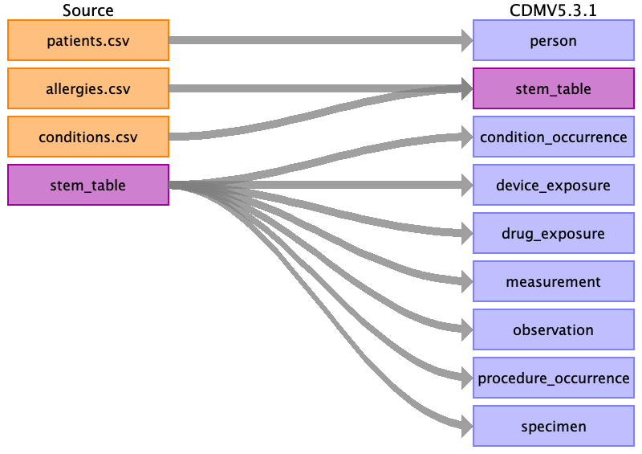

# Source Data Mapping Approach to CDMV5.3.1

## Contents

[person](person.md)

[stem_table](stem_table.md)

[condition_occurrence](condition_occurrence.md)

[device_exposure](device_exposure.md)

[drug_exposure](drug_exposure.md)

[measurement](measurement.md)

[observation](observation.md)

[procedure_occurrence](procedure_occurrence.md)

[specimen](specimen.md)

[source_appendix](source_appendix.md)

