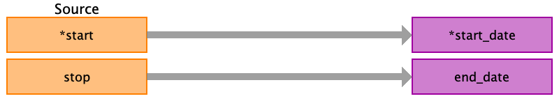

## Table name: stem_table

### Reading from allergies.csv

| Destination Field | Source field | Logic | Comment field |
| --- | --- | --- | --- |
| domain_id |  |  |  |
| person_id | patient |  |  |
| visit_occurrence_id | encounter |  |  |
| provider_id |  |  |  |
| id |  |  |  |
| concept_id | code |  |  |
| source_value | code |  |  |
| source_concept_id | code |  |  |
| type_concept_id |  |  |  |
| start_date | start |  |  |
| start_datetime |  |  |  |
| end_date |  |  |  |
| end_datetime |  |  |  |
| verbatim_end_date |  |  |  |
| days_supply |  |  |  |
| dose_unit_source_value |  |  |  |
| lot_number |  |  |  |
| modifier_concept_id |  |  |  |
| operator_concept_id |  |  |  |
| modifier_concept_id |  |  |  |
| modifier_source_value |  |  |  |
| quantity |  |  |  |
| range_high |  |  |  |
| range_low |  |  |  |
| refills |  |  |  |
| route_concept_id |  |  |  |
| route_source_value |  |  |  |
| sig |  |  |  |
| stop_reason |  |  |  |
| unique_device_id |  |  |  |
| unit_concept_id |  |  |  |
| unit_source_value |  |  |  |
| value_as_concept_id |  |  |  |
| value_as_number |  |  |  |
| value_as_string |  |  |  |
| value_source_value |  |  |  |
| anatomic_site_concept_id |  |  |  |
| disease_status_concept_id |  |  |  |
| specimen_source_id |  |  |  |
| anatomic_site_source_value |  |  |  |
| disease_status_source_value |  |  |  |
| condition_status_concept_id |  |  |  |
| condition_status_source_value |  |  |  |
| qualifier_concept_id |  |  |  |
| qualifier_source_value |  |  |  |

### Reading from conditions.csv

| Destination Field | Source field | Logic | Comment field |
| --- | --- | --- | --- |
| domain_id |  |  |  |
| person_id |  |  |  |
| visit_occurrence_id |  |  |  |
| provider_id |  |  |  |
| id |  |  |  |
| concept_id |  |  |  |
| source_value |  |  |  |
| source_concept_id |  |  |  |
| type_concept_id |  |  |  |
| start_date | start |  |  |
| start_datetime |  |  |  |
| end_date | stop |  |  |
| end_datetime |  |  |  |
| verbatim_end_date |  |  |  |
| days_supply |  |  |  |
| dose_unit_source_value |  |  |  |
| lot_number |  |  |  |
| modifier_concept_id |  |  |  |
| operator_concept_id |  |  |  |
| modifier_concept_id |  |  |  |
| modifier_source_value |  |  |  |
| quantity |  |  |  |
| range_high |  |  |  |
| range_low |  |  |  |
| refills |  |  |  |
| route_concept_id |  |  |  |
| route_source_value |  |  |  |
| sig |  |  |  |
| stop_reason |  |  |  |
| unique_device_id |  |  |  |
| unit_concept_id |  |  |  |
| unit_source_value |  |  |  |
| value_as_concept_id |  |  |  |
| value_as_number |  |  |  |
| value_as_string |  |  |  |
| value_source_value |  |  |  |
| anatomic_site_concept_id |  |  |  |
| disease_status_concept_id |  |  |  |
| specimen_source_id |  |  |  |
| anatomic_site_source_value |  |  |  |
| disease_status_source_value |  |  |  |
| condition_status_concept_id |  |  |  |
| condition_status_source_value |  |  |  |
| qualifier_concept_id |  |  |  |
| qualifier_source_value |  |  |  |

